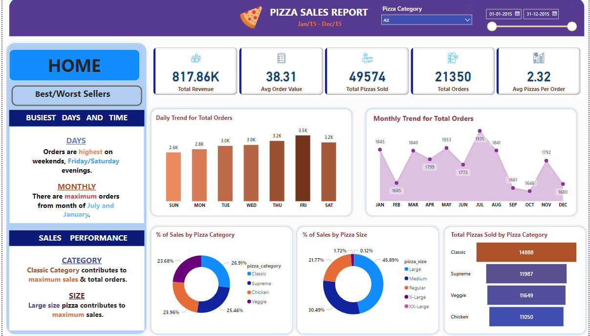

# Pizza-sales-data-analysis
I analyzed and visualized pizza sales data using SQL, Excel, and Power BI. By using Data visualization, and utilizing business intelligence tools to derive meaningful insights. 
 
 

## Key Highlights:

- 📈 Data analysis using SQL for extracting and transforming data
- 📊 Excel for data cleaning and preliminary analysis
- 📉 Power BI for creating interactive visualizations.

 

Through this project, I was able to uncover trends in sales, identify peak sales periods, and provide actionable insights for business decisions.

 

 

 

